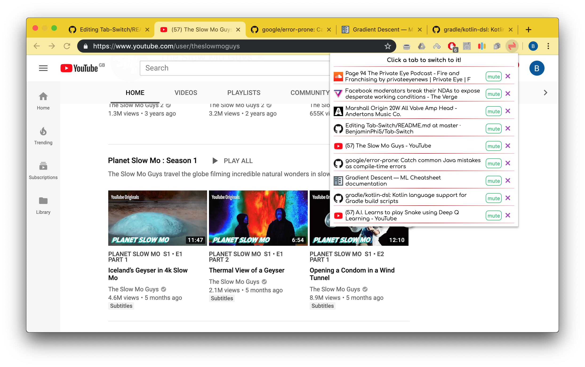

    

Often you can quickly accumulate a large number of tabs, and being able to quickly switch between them, regardless of window or desktop, is particularly useful. Tab-Switch allows you to see all tabs currently open and quickly switching between them. It also allows muting and closing of tabs from within the popup.

# Future features to be included
* shortcuts to provide the same functionality without moving the mouse
* allow seach of currently open tabs
* prevent xss scripting issues on page titles
* actually release to chrome webstore
* quick link to be able to share a particular tab.

# installation
For now, this is no on the chrome webstore, as xss attack prevention needs to be dealt with. However you can test it by cloning the repositorym going to extensions in chrome, turning on developer mode and selecting load unpacked extension.
